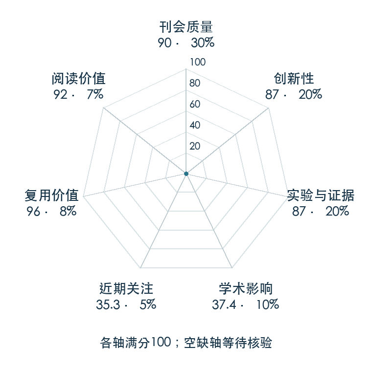

# Walk These Ways: Tuning Robot Control for Generalization with Multiplicity of Behavior

**Walk These Ways** · CoRL 2022 · 本版排名 92 · 综合分 **80.7 / 100**

[解读导读](../../../library/walk-these-ways.md) · [Locomotion 与运动适应](../../../paper-map/README.md#track-locomotion) · [CoRL集锦](../../../venues/CoRL/README.md)

[原文](https://proceedings.mlr.press/v205/margolis23a.html) · [PDF](https://proceedings.mlr.press/v205/margolis23a/margolis23a.pdf) · [阅读卡片](../../../library/walk-these-ways.md)

论文出处：[**Gabriel B. Margolis**](../../origins/papers/walk-these-ways.md) [麻省理工学院 Improbable AI 实验室](../../origins/papers/walk-these-ways.md)

## 机制简析

一个策略同时接收三维速度命令和八维行为参数，后者控制足端相位、频率、身体姿态与抬脚等走法。历史本体观测与这些命令共同输入网络，输出十二个关节的位置目标。测试时人可以调整行为参数，在不重训情况下为新任务挑选合适步态。

带着这个问题读：遇到新地面不重训，能否直接调一组步态参数让同一个策略换种走法？

初读判断：可调参数定义清楚，有实机多行为、能耗和分布外任务比较，公开控制器使读者能够继续实验。

## 七维评分

<picture>
  <source media="(prefers-color-scheme: dark)" srcset="radar-dark.gif">
  
</picture>

[透明静态图](radar.svg) · [深色静态图](radar-dark.svg)

| 维度 | 分数 / 100 | 权重 |
| --- | --- | --- |
| 公开与评审 | 90.0 | 30% |
| 创新性 | 87 | 20% |
| 实验与证据 | 87 | 20% |
| 学术影响 | 37.4 | 10% |
| 近期关注 | 21.7 | 5% |
| 复用价值 | 96 | 8% |
| 阅读价值 | 92 | 7% |

刊会依据：[CoRL 2022](../../../venues/CoRL/README.md)，正式出处见[出版/原文记录](https://proceedings.mlr.press/v205/margolis23a.html)；采用2026-10-10刊会快照。

公开与评审依据：完整论文已公开，作者、日期与版本/固定论文身份可追溯，公开材料阶段计60。；正式刊会按登记量表计分，取较高阶段。

编辑深度：原文摘要/方法与实验初读；评分记录：2026-10-10。

计量来源：OpenAlex；作者预印本/原研究索引记录；匹配题目：Walk These Ways: Tuning Robot Control for Generalization with Multiplicity of Behavior。累计被引 **19**，2025–2026 被引 **8**；快照：2026-10-10T09:51:57+08:00。

[指标记录](https://api.openalex.org/works/W4310886200) · [文献计量条目](https://openalex.org/W4310886200)

### 影响与关注的计算依据

- **学术影响 37.4**：身份匹配的累计引用C=19，对数压缩上限3000。 [依据1](https://api.openalex.org/works/W4310886200)
- **近期关注 21.7**：近期已定位引用R=8；数量与每月引用速度各占一半，有效观察期21.2567个月。 [依据1](https://api.openalex.org/works/W4310886200)

### 论文公开入口与传播快照

| 平台 / 入口 | 公开计量 | 统计范围 | 快照 |
| --- | --- | --- | --- |
| [github](https://github.com/Improbable-AI/rapid-locomotion-rl) | GitHub Star 300；GitHub Watch订阅 5；GitHub Fork 49 | 其他研究入口；截至2026-10-10的累计快照 | 2026-10-10 |
| [github](https://github.com/Improbable-AI/walk-these-ways) | GitHub Star 1461；GitHub Watch订阅 14；GitHub Fork 223 | 单篇论文仓库；截至2026-10-10的累计快照 | 2026-10-10 |

[传播数据与采用依据](../../social-signals.json)保留归属、统计窗口与计分信号。
[评分说明](../../methodology.md) · [返回具身榜](../../README.md) · [论文地图](../../../paper-map/README.md)
